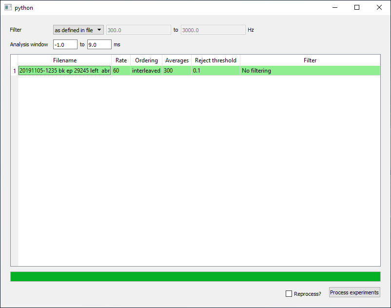

=========================================
 Software
=========================================

ABR post-processing script
--------------------------
Since psiexperiment saves single-trial, continuous data for ABRs, the data must be post-processed after acquisition for use with the `ABR waveform analysis <https://github.com/bburan/abr>`_ software. To run the program, select 'ABR post-acquisition processing' from the start menu (see XXX for command-line usage).

To load files, drag-and-drop the folder containing the ABR data onto the GUI. Unprocessed files are shown with a white background. If the file has already been processed, it will be shown with a green background. Once you have loaded the files you wish to process, you can specify the filter and epoch settings. By default, the filter settings specified during acquisition will be loaded from the file. If you wish to reprocess a file, you need to check the "reprocess files". 

Be patient. It can take a while to proces each file. Once the files are done processing, they will be highlighted in green (if successful) or pink (if there was an error).
